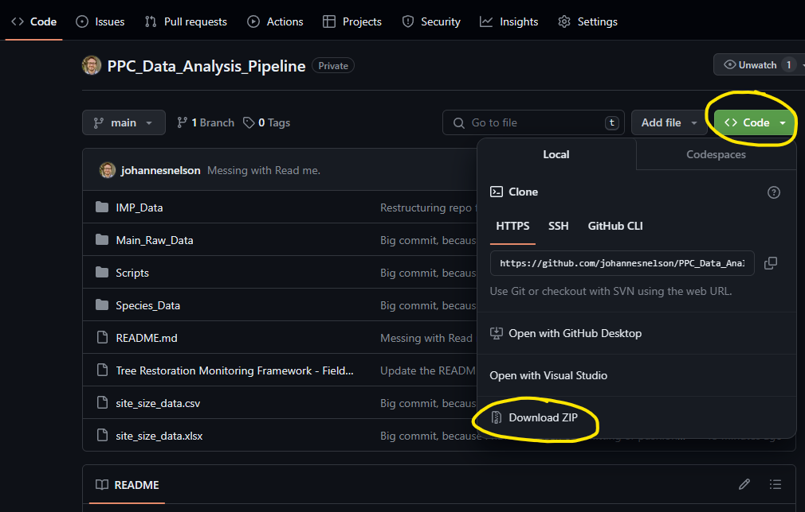
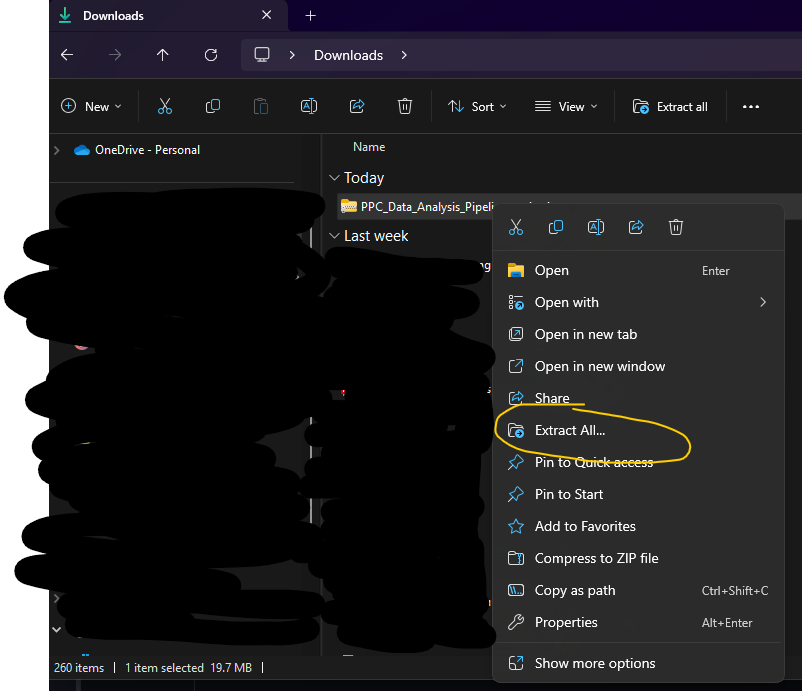

# Priceless Planet Coalition Data Analysis Pipeline

## Overview
This repository houses the data processing/analysis scripts for dealing with PPC
monitoring data. The most important folder here is the 'Scripts' folder, which 
contains executable R scripts, each of which perform a different essential function.
Some of these scripts need to be executed in a certain order, because outputs of
one will become inputs to the next. Others can be run as standalone scripts. 

The other folders in the repository contain key information that enable the scripts
to run seamlessly. It is is important not to change the directory structures! Do
not rename folders or move them around. The scripts will all assume that the parent
folder in this repository is set as the working directory, and as such when they
search for necessary files, if they are renamed or moved, they will not be able to
run.

## How to download
If you are familiar with git, you can clone the repository in a directory of your 
choice. If not, the simplest way is to click on the green code button in the top
right corner of the repository page, and then 'Download Zip'. Here is a screenshot:

After this, unzipping will look slightly differently if you're on a Mac, but find
this zipped file and extract its contents into a location of your choosing. This
is what that looks like on PC:

After you've unzipped it, you should have a replica of this GitHub repository on
your local machine. If the repository is every updated (with fixes, etc.), you 
will need to re-download the zip. 

## What is in this repository?

* **Scripts:** This folder houses the scripts that perform all the functions:
  * **Extract_Main_Data.R:** a script to extract data from Kobo toolbox, process it, 
  and create CSV files.
  * **Extract_Brazil_Data.R:** This script does the same as the above, but handles the
  particularities of the Brazil data accordingly. 
  * **Correct_Species_Names.R:** This script automatically corrects most species names
  and provides functionality for the user to correct the rest.
  * **Add_Family_Names.R:** This script uses online databases to search for and add
  taxonomic family names to the dataset.
  * **Analyze_Data.R:** This processes the cleaned and wrangled dataset to generate
  baseline reports, as well as data pertaining to the PPC indicators such as 
  trees restored, trees naturally regenerated, and survival rate of planted trees.
  * **IMP_Invasive_species_scanner.R:** This script takes an exported IMP data file, 
  preprocesses it, and then scans the planted species for potential invasives.
  * **IMP_Native_Alien_Classification.R:** This script aids in the process of 
  classifying native and alien species.
  * **Invasive_Species_Scanner.R:** This is a standalone version of the invasives 
  scanner that can be used on a simply formatted species list.
  
  
* **Species_Data** This folder houses the taxonomic corrections data.
  * **Taxonomic_Corrections_YYYY-MM-DD_HHMM.csv:** Files with this naming convention
  will be generated each time certain scripts are run. These are cumulative records
  of species name corrections. At handover, the file here contains thousands of corrections,
  and it will serve as the base for future corrections. 
  * **Family_Names_YYYY-MM-DD_HHMM.csv:** This is a similar file, only it has up
  to date family names information.

* **IMP_Data** This folder houses the exported IMP planting data, as well as the
folders and files associated with processing it.
  

NOTE: If you've made new species corrections or family names corrections, you 
will want to save those files and manually copy them over to the updated repo.
This repository